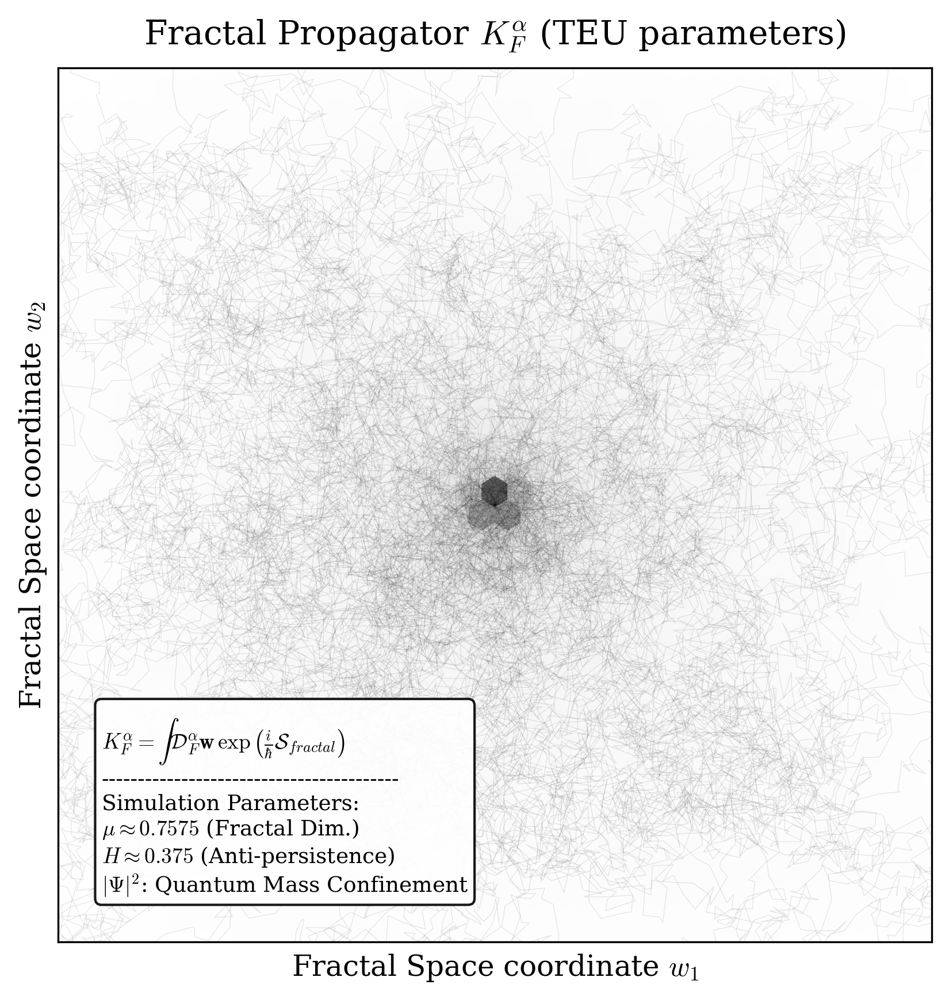

# Visualizaciones del Propagador Fractal TEU 🌌

Este repositorio contiene scripts de simulación auxiliares y visualizaciones matemáticas para el modelo **Topological Electron Universe (TEU)**. 

Mientras que los cálculos analíticos duros de la QED se alojan en el repositorio principal TEU, este espacio está dedicado a explorar la naturaleza estocástica y geométrica del vacío cuántico, centrándose específicamente en cómo las topologías fractales generan la masa inercial a través de sub-difusión anómala.


## La Física: Simulando el *Mass Gap* (Génesis de la Masa)

El script `fractal_propagator_sim.py` demuestra visualmente la emergencia de la masa del electrón sin depender de campos escalares externos (como el mecanismo de Higgs). Lo logra simulando la **Integral de Caminos de Feynman Fractal**.

### 1. El Propagador Fractal de Golmankhaneh ($K_F^\alpha$)
En la Mecánica Cuántica estándar, las partículas exploran todos los caminos posibles en un espacio euclídeo suave. Sin embargo, basándonos en la formulación del $F^\alpha$-Cálculo para curvas no diferenciables (Golmankhaneh & Baleanu, 2013), la amplitud de probabilidad (el Propagador $K_F^\alpha$) de que una partícula se mueva a través de un vacío tipo Cantor viene dada por:

$$K_{F}^{\alpha} = \int \mathcal{D}_{F}^{\alpha} \mathbf{w} \, \exp\left(\frac{i}{\hbar} \mathcal{S}_{fractal}\right)$$

Aquí, la integración se realiza sobre la medida fractal $\mathcal{D}_F^\alpha$, y $\mathcal{S}_{fractal}$ es la acción cuántica modificada.

### 2. La Rigidez Geométrica TEU ($K_{geo}$)
¿Cómo se conecta el modelo TEU con este propagador? En nuestro marco teórico, el Laplaciano euclídeo se proyecta sobre la variedad fractal, generando una impedancia espacial intrínseca conocida como **Rigidez Geométrica ($K_{geo}$)**. 

Derivada analíticamente del momento magnético anómalo de la QED ($g-2$), el vacío TEU posee una rigidez exacta de:
$$K_{geo} \approx 2.659$$

### 3. El Puente: El Exponente de Hurst ($H$)
Para simular esta acción analítica ($\mathcal{S}_{fractal}$) usando métodos estocásticos de Monte Carlo, traducimos la rigidez geométrica a una dimensión de caminata aleatoria ($d_w$). El **Exponente de Hurst ($H$)** correspondiente es simplemente la inversa de esta rigidez:

$$H = \frac{1}{K_{geo}} \approx 0.375$$

### ¿Cómo funciona el código? (Síntesis Espectral)
El script en Python no resuelve la integral infinita de Feynman por fuerza bruta. En su lugar, simula el resultado fenomenológico utilizando **Ruido Gaussiano Fraccionario (fGn)** mediante Síntesis Espectral:

1. Un vacío de Minkowski estándar no tiene fricción topológica ($K_{geo}=2 \implies H=0.5$), lo que resulta en ruido blanco normal. La partícula se difunde libremente.
2. Al inyectar el parámetro TEU ($H = 0.375$) en el espectro de potencia de Fourier ($S(f) \propto f^{-(1-2H)}$), el algoritmo obliga a las frecuencias a generar pasos correlacionados negativamente (Régimen Anti-persistente).
3. **El Resultado:** El paquete de ondas cuántico simulado ($|\Psi|^2$) no puede expandirse libremente. Se repliega continuamente sobre sí mismo debido a los huecos topológicos (polvo de Cantor), creando un núcleo de probabilidad denso y localizado.

**Este confinamiento geométrico es el fenómeno macroscópico que nosotros medimos empíricamente como Masa Inercial.**





## Uso
Simplemente ejecuta el script de Python para generar los gráficos en alta resolución (PDF/PNG) de la nube cuántica:
```bash
python fractal_propagator_sim.py
