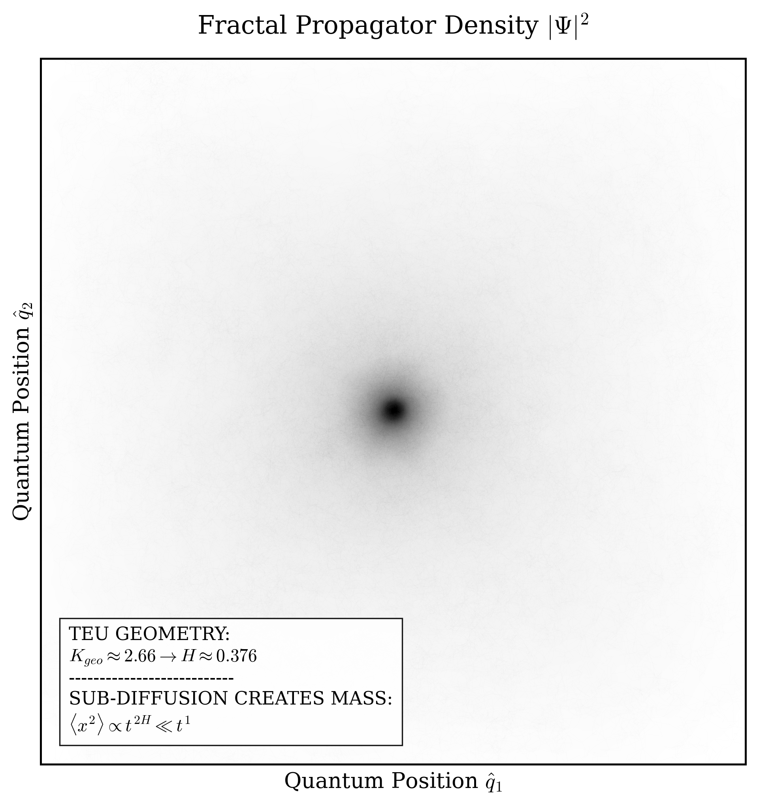
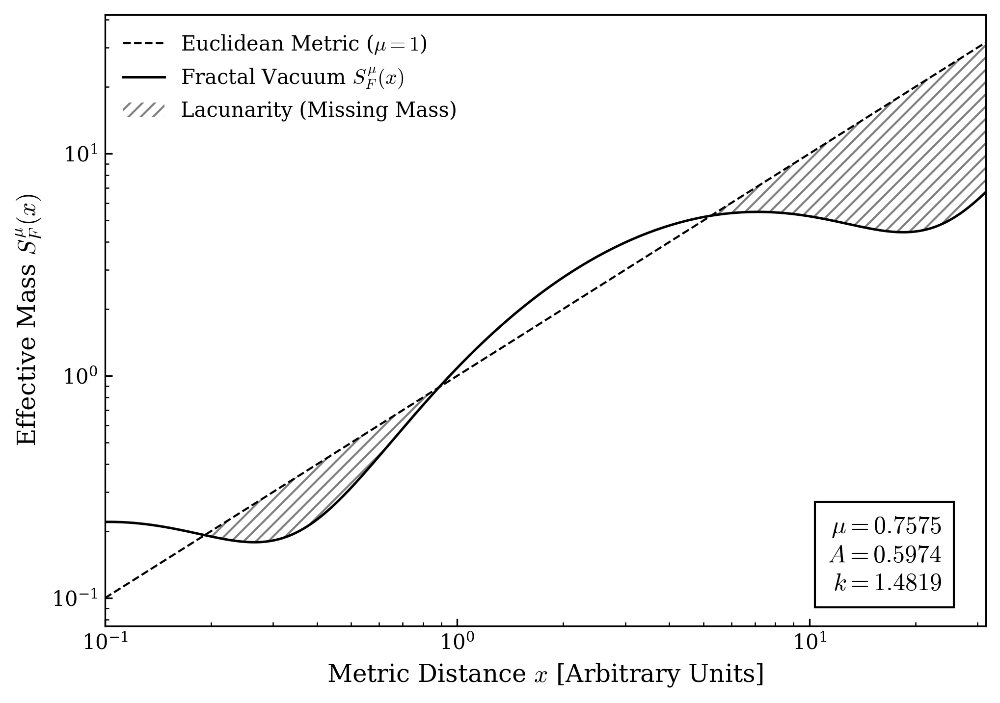
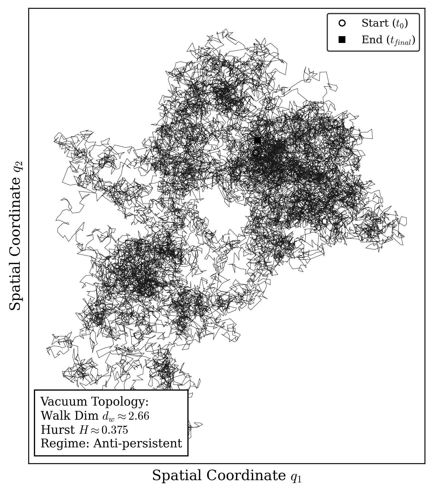
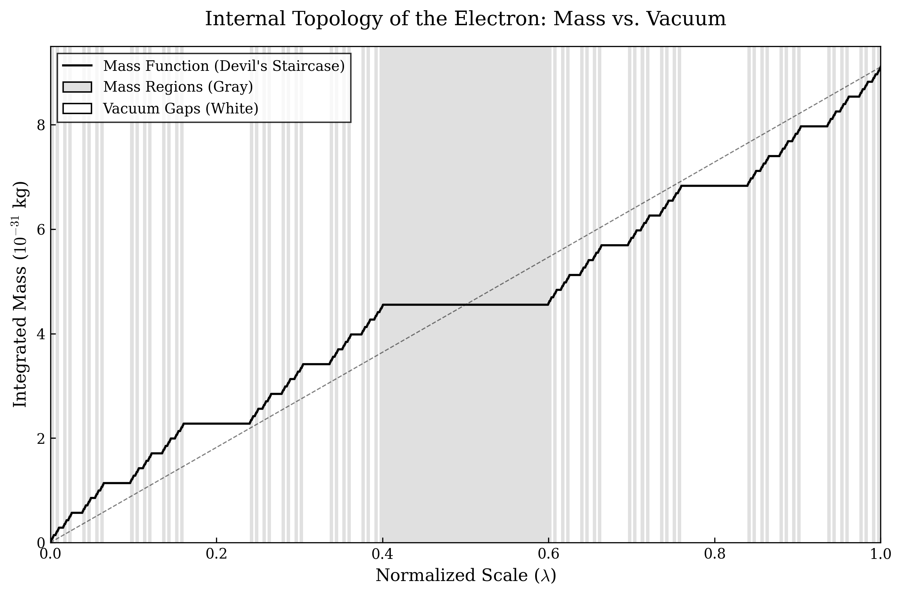
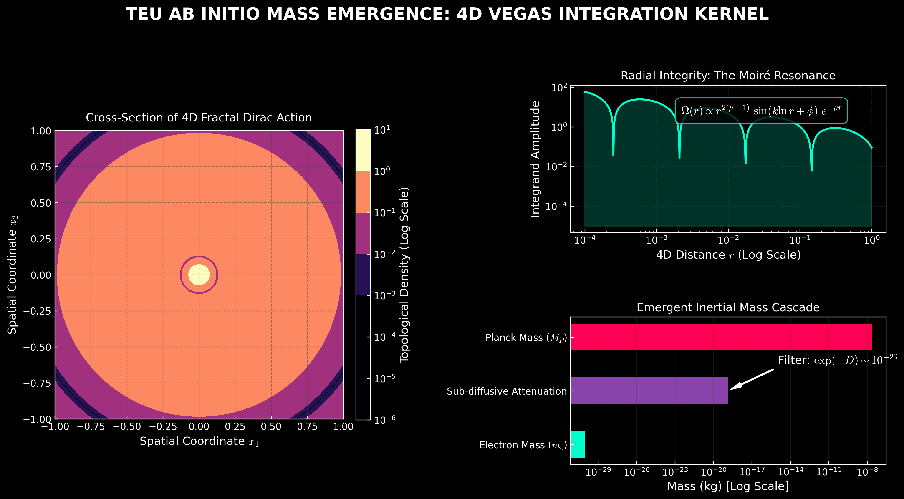

# TEU - FRACTAL FIGURES .

[](https://doi.org/10.5281/zenodo.18807956)


# Visualizaciones del Propagador Fractal TEU 

Este repositorio contiene scripts de simulación auxiliares y visualizaciones matemáticas para el modelo **Topological Electron Universe (TEU)**. 

Mientras que los cálculos analíticos duros de la QED se alojan en el repositorio principal TEU, este espacio está dedicado a explorar la naturaleza estocástica y geométrica del vacío cuántico, centrándose específicamente en cómo las topologías fractales generan la masa inercial a través de sub-difusión anómala.


## La Física: Simulando el *Mass Gap* (Génesis de la Masa)

El script `fractal_propagator_sim.py` demuestra visualmente la emergencia de la masa del electrón sin depender de campos escalares externos (como el mecanismo de Higgs). Lo logra simulando la **Integral de Caminos de Feynman Fractal**.

### 1. El Propagador Fractal de Golmankhaneh ($K_F^\alpha$)
En la Mecánica Cuántica estándar, las partículas exploran todos los caminos posibles en un espacio euclídeo suave. Sin embargo, basándonos en la formulación del $F^\alpha$-Cálculo para curvas no diferenciables (Golmankhaneh & Baleanu, 2013), la amplitud de probabilidad (el Propagador $K_F^\alpha$) de que una partícula se mueva a través de un vacío tipo Cantor viene dada por:

$$K_{F}^{\alpha} = \int \mathcal{D}_{F}^{\alpha} \mathbf{w} \, \exp\left(\frac{i}{\hbar} \mathcal{S}_{fractal}\right)$$

Aquí, la integración se realiza sobre la medida fractal $\mathcal{D}_F^\alpha$, y $\mathcal{S}_{fractal}$ es la acción cuántica modificada.

### 2. La Rigidez Geométrica TEU ($K_{geo}$)
¿Cómo se conecta el modelo TEU con este propagador? En nuestro marco teórico, el Laplaciano euclídeo se proyecta sobre la variedad fractal, generando una impedancia espacial intrínseca conocida como **Rigidez Geométrica ($K_{geo}$)**. 

Derivada analíticamente del momento magnético anómalo de la QED ($g-2$), el vacío TEU posee una rigidez exacta de:
$$K_{geo} \approx 2.659$$

### 3. El Puente: El Exponente de Hurst ($H$)
Para simular esta acción analítica ($\mathcal{S}_{fractal}$) usando métodos estocásticos de Monte Carlo, traducimos la rigidez geométrica a una dimensión de caminata aleatoria ($d_w$). El **Exponente de Hurst ($H$)** correspondiente es simplemente la inversa de esta rigidez:

$$H = \frac{1}{K_{geo}} \approx 0.375$$

### ¿Cómo funciona el código? (Síntesis Espectral)
El script en Python no resuelve la integral infinita de Feynman por fuerza bruta. En su lugar, simula el resultado fenomenológico utilizando **Ruido Gaussiano Fraccionario (fGn)** mediante Síntesis Espectral:

1. Un vacío de Minkowski estándar no tiene fricción topológica ($K_{geo}=2 \implies H=0.5$), lo que resulta en ruido blanco normal. La partícula se difunde libremente.
2. Al inyectar el parámetro TEU ($H = 0.375$) en el espectro de potencia de Fourier ($S(f) \propto f^{-(1-2H)}$), el algoritmo obliga a las frecuencias a generar pasos correlacionados negativamente (Régimen Anti-persistente).
3. **El Resultado:** El paquete de ondas cuántico simulado ($|\Psi|^2$) no puede expandirse libremente. Se repliega continuamente sobre sí mismo debido a los huecos topológicos (polvo de Cantor), creando un núcleo de probabilidad denso y localizado.

**Este confinamiento geométrico es el fenómeno macroscópico que nosotros medimos empíricamente como Masa Inercial.**


# Visualización 2: Nube Cuántica y el Origen de la Masa ($|\Psi|^2$)

Este apartado del repositorio presenta la simulación de densidad `simulacion_nube_cuantica.py`. Esta simulación visualiza la consecuencia macroscópica directa de las trayectorias fractales generadas por el modelo TEU.



## Las Matemáticas de la Masa: Confinamiento por Sub-difusión

Mientras que la mecánica cuántica canónica y la Ecuación de Schrödinger asumen un espaciotiempo liso, el universo TEU postula que el espacio subatómico está gobernado por una red métrica de Cantor. Esto tiene una consecuencia cinemática ineludible: la **Difusión Anómala**.


### 1. El Vínculo Topología-Cinemática
Como se demostró en el modelo TEU, la interacción analítica del Electromagnetismo genera una "fricción" en el operador Laplaciano denominada **Rigidez Geométrica ($K_{geo}$)**. En la teoría del transporte estocástico, la dificultad para atravesar esta geometría define la dimensión de la caminata, la cual fija el **Exponente de Hurst ($H$)**:

$$H = \frac{1}{K_{geo}} = \frac{1}{2.659} \approx 0.376$$

### 2. Ecuación de Varianza de la Posición
En un vacío estándar de Minkowski (donde $H = 0.5$), un paquete de ondas sin masa se difunde libremente, y su Desplazamiento Cuadrático Medio (MSD) crece linealmente con el tiempo ($\langle x^2 \rangle \propto t$).

Sin embargo, dado que el modelo TEU arroja $H < 0.5$, el electrón entra en un régimen de **Sub-difusión Fuerte** o comportamiento *anti-persistente*. La ecuación que gobierna la propagación de este paquete es:

$$\langle x^2(t) \rangle \propto t^{2H} \approx t^{0.75}$$

### ¿Qué hace el script en Python?
El script genera $5000$ caminos estocásticos de memoria larga y calcula su campo de densidad probabilística global ($|\Psi|^2$) a través de un histograma suavizado 2D. 

**Interpretación Física:** Al crecer la varianza con un exponente menor a 1 ($\approx 0.75$), las partículas colisionan estadísticamente contra la "Escalera del Diablo" métrica y son empujadas hacia atrás, rellenando el espacio localmente. Esta trampa topológica crea un núcleo negro ultra-denso en el centro de la simulación. La resistencia intrínseca a propagarse libremente inducida por esta sub-difusión es precisamente lo que nosotros medimos fenotípicamente como **Masa Inercial**.

# Fundamentos Geométricos del Modelo TEU 

Este repositorio complementario aloja los scripts en Python responsables de generar las representaciones gráficas fundamentales del marco **Topological Electron Universe (TEU)**. 

A través de estos algoritmos, materializamos visualmente dos conceptos críticos del modelo: la topología del vacío cuántico (la Escalera de Cantor) y su cinemática resultante (el confinamiento sub-difusivo del electrón).

---

## 1. La Topología del Vacío: La Métrica de Cantor ($S_F^\mu$)

La primera gráfica generada ilustra la diferencia fundamental entre el espacio asumido por la física ortodoxa y el postulado por el modelo TEU.



### Matemáticas subyacentes
La Teoría Cuántica de Campos (TQC) canónica asume que el universo es una variedad euclídea lisa ($\mu=1$), donde la distancia crece de forma lineal y continua (línea punteada). 

El modelo TEU postula que, a escala cuántica, el espacio es un conjunto fractal lagunar (Polvo de Cantor). Basándonos en el formalismo del $F^\alpha$-Cálculo de Parvate y Gangal, la "distancia real" experimentada por un paquete de ondas viene descrita por la Función de Masa Fractal $S_F^\mu(x)$:

$$S_F^\mu(x) \approx \frac{x^\mu}{\Gamma(\mu+1)} [1 + A \sin(k \ln x)]$$

* **Dimensión Efectiva ($\mu \approx 0.7575$):** Dicta la tendencia asintótica global. Al ser menor que 1, el volumen métrico real es estrictamente menor que el euclídeo.
* **Lacunaridad ($A \approx 0.5974$):** Genera la firma log-periódica (los escalones). El área rayada representa la "masa faltante" o los poros del espaciotiempo por donde la onda cuántica no puede propagarse.

---

## 2. Cinemática Topológica: La Génesis de la Inercia

La segunda gráfica revela qué le ocurre a una partícula cuántica cuando intenta moverse a través de esa geometría lagunar (la "Escalera del Diablo" de la gráfica anterior).



### Matemáticas subyacentes
La rugosidad espacial altera el operador Laplaciano en la Ecuación de Schrödinger, generando una impedancia denominada **Rigidez Geométrica ($K_{geo}$)**. En la teoría de transporte, esta rigidez equivale a la dimensión de la caminata aleatoria ($d_w \approx 2.66$).

Mediante la simulación estocástica de Síntesis Espectral de Fourier, el script traduce esta rigidez topológica en un **Exponente de Hurst ($H$)**:

$$H = \frac{1}{K_{geo}} = \frac{1}{2.6605} \approx 0.375$$

Al ser $H < 0.5$, la partícula entra en un régimen estocástico **Anti-persistente** (Sub-difusión Fuerte). La trayectoria generada visualiza cómo el electrón "choca" estadísticamente contra los saltos del fractal, viéndose forzado a retroceder y rellenar el espacio localmente en lugar de viajar en línea recta.

La ecuación que gobierna esta trampa espacial es:
$$\langle x^2(t) \rangle \propto t^{2H} \approx t^{0.75}$$

**Conclusión:** Esta incapacidad puramente geométrica de propagarse libremente a la velocidad de la luz es el fenómeno fenomenológico que medimos macroscópicamente como **Masa Inercial**.

---
# Visualización 3: Topología Interna del Electrón (El "Código de Barras" TEU) 

Este repositorio contiene el script `teu_barcode_plot.py`, el cual genera una tomografía transversal del espacio cuántico ocupado por un electrón según el modelo **Topological Electron Universe (TEU)**. 

Lejos de ser una esfera sólida de carga, el electrón TEU es una estructura matemática discontinua. Esta gráfica ilustra la competencia directa entre el "vacío" y la "masa".



## Las Matemáticas detrás de la Imagen

La imagen superpone dos elementos matemáticos fundamentales: el **Polvo de Cantor** (las franjas de fondo) y la **Función Escalera del Diablo** (la curva de acumulación de masa).

### 1. El Ratio de Vacío (Gap Ratio)
En la teoría clásica, la masa inercial de una partícula se acumula de forma continua (representado por la línea punteada euclídea). En el modelo TEU, el espacio está perforado. 

Para que la geometría satisfaga la dimensión fractal predicha por el electromagnetismo ($\mu \approx 0.7576$), el tamaño relativo de las lagunas de vacío (las franjas blancas) no puede ser arbitrario. El script calcula el tamaño exacto del hueco central iterativo despejando el ratio a partir de la ecuación dimensional de los conjuntos de Cantor simétricos:

$$2 \left( \frac{1 - \text{Gap Ratio}}{2} \right)^\mu = 1$$

Al despejar, el código obtiene la relación constitutiva del vacío:
$$\text{Gap Ratio} = 1 - 2^{1 - 1/\mu}$$

Con $\mu \approx 0.7576$, esto nos dice que en cada nivel de resolución espacial, una fracción matemáticamente exacta del espacio desaparece, formando las "bandas blancas" de nuestro código de barras.

### 2. La Escalera del Diablo (Mass Function)
La línea negra continua es la representación exacta de la **Masa Acumulada** del electrón (hasta llegar a su valor CODATA de $\approx 9.109 \times 10^{-31}$ kg). 
* **Zonas Grises (Masa):** En estas regiones existe soporte topológico. El espacio es denso y la curva negra sube, acumulando inercia.
* **Zonas Blancas (Vacío/Lagunas):** En estas zonas no hay espaciotiempo subyacente. La curva negra se vuelve completamente plana (derivada nula). El paquete de ondas salta cuánticamente sobre este abismo sin acumular masa.

### Interpretación Física
La gráfica demuestra visualmente la "Lagunaridad" del universo. La masa del electrón no es una sustancia continua, sino la suma integrada de infinitas islas de espaciotiempo (las zonas grises) separadas por abismos topológicos (las zonas blancas). La resistencia estocástica (difusión) a cruzar este "código de barras" es el origen de la inercia cuántica.

# Visualización 4: El Dashboard del Hiperespacio 4D (Integración VEGAS) 

Este repositorio también incluye el script `teu_vegas_dashboard.py`, el cual genera una visualización tipo panel de control del kernel matemático topológico utilizado para calcular la masa del electrón *ab initio*.



## ¿Qué estamos viendo en esta gráfica?

Para extraer la masa inercial del electrón a partir del vacío cuántico, el repositorio principal TEU emplea el **Integrador Monte Carlo VEGAS** a través de un hiperespacio de 4 dimensiones. Este dashboard visualiza el integrando (el "paisaje de fricción") por el que navega el algoritmo VEGAS:

1. **Panel Izquierdo (Corte Transversal):** Una sección 2D del espacio euclídeo 4D. El núcleo brillante de magma muestra la extrema densidad topológica cerca del origen, demostrando cómo la métrica lagunar de Cantor altera drásticamente el comportamiento del espaciotiempo antes de llegar al límite de Planck (*Planck cutoff*).
2. **Panel Superior Derecho (Resonancia de Moiré):** Un perfil radial del integrando. Las oscilaciones log-periódicas (Polvo de Cantor) generan una "Resonancia de Moiré" en la amplitud, lo que hace imposible la integración analítica canónica y hace imprescindible el uso de métodos estocásticos avanzados (VEGAS).
3. **Panel Inferior Derecho (Cascada de Masa):** Muestra el resultado fenomenológico de la integración. La resistencia topológica calculada por VEGAS actúa como un implacable filtro exponencial, atenuando la Masa Desnuda de Planck ($M_P$) en 23 órdenes de magnitud hasta que emerge macroscópicamente como la masa empírica del Electrón ($m_e$).


## Uso del Script
El código está optimizado para su ejecución en entornos estándar de Python con `matplotlib`.
```bash
python teu_barcode_plot.py

## Uso del Script

El código utiliza `matplotlib` estándar y `scipy`. Para generar los PDF vectorizados (para publicación) y los PNG en alta resolución (300 dpi):

```bash
python generate_scientific_plots.py
## Uso
Simplemente ejecuta el script de Python para generar los gráficos en alta resolución (PDF/PNG) de la nube cuántica:
```bash
python fractal_propagator_sim.py
